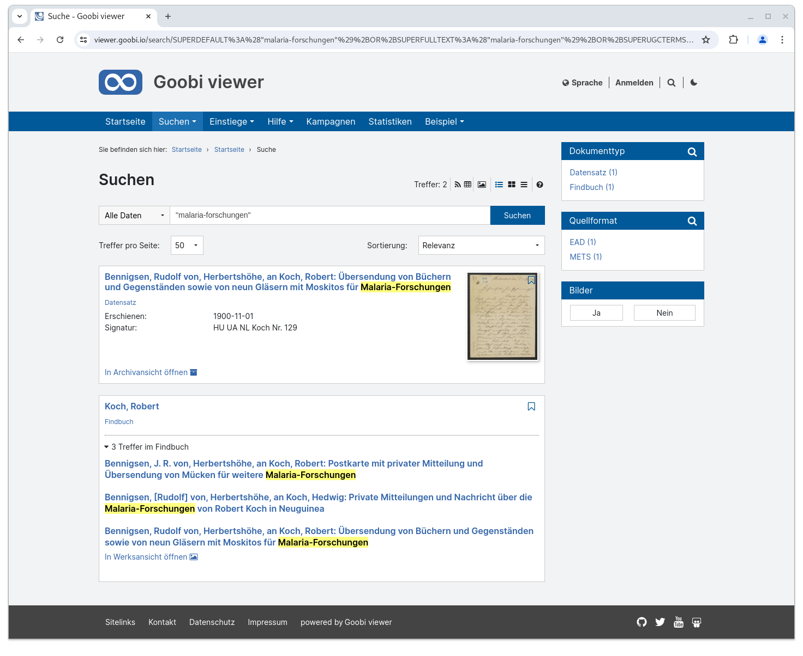
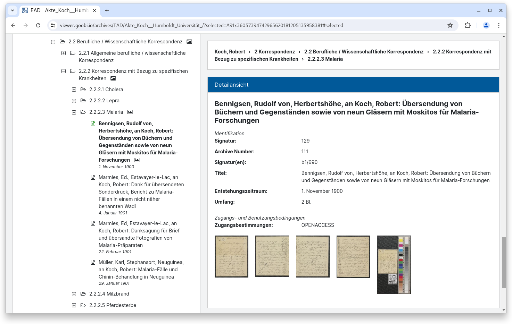
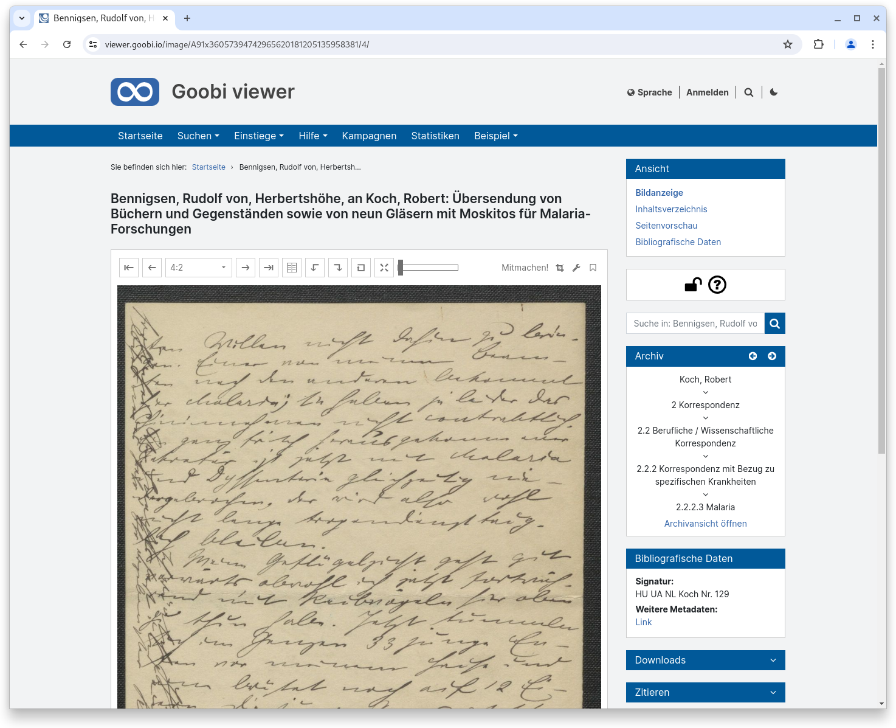
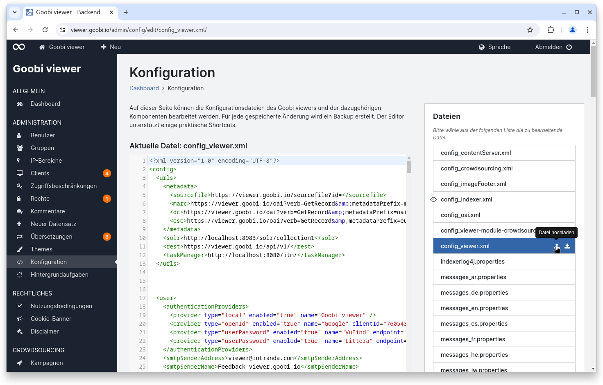
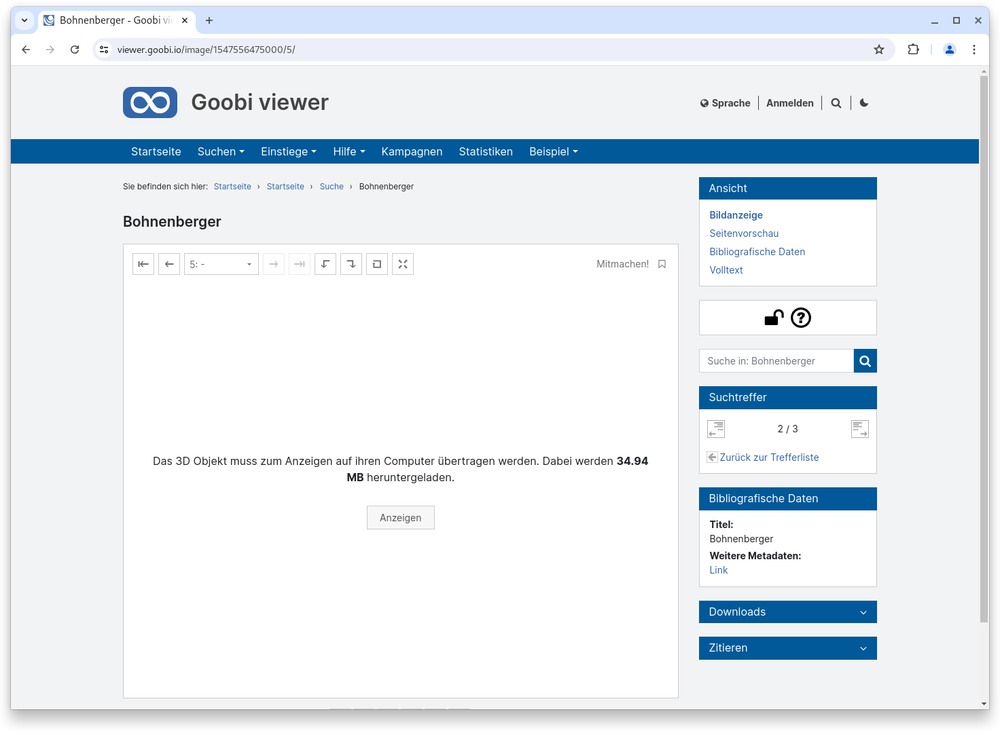
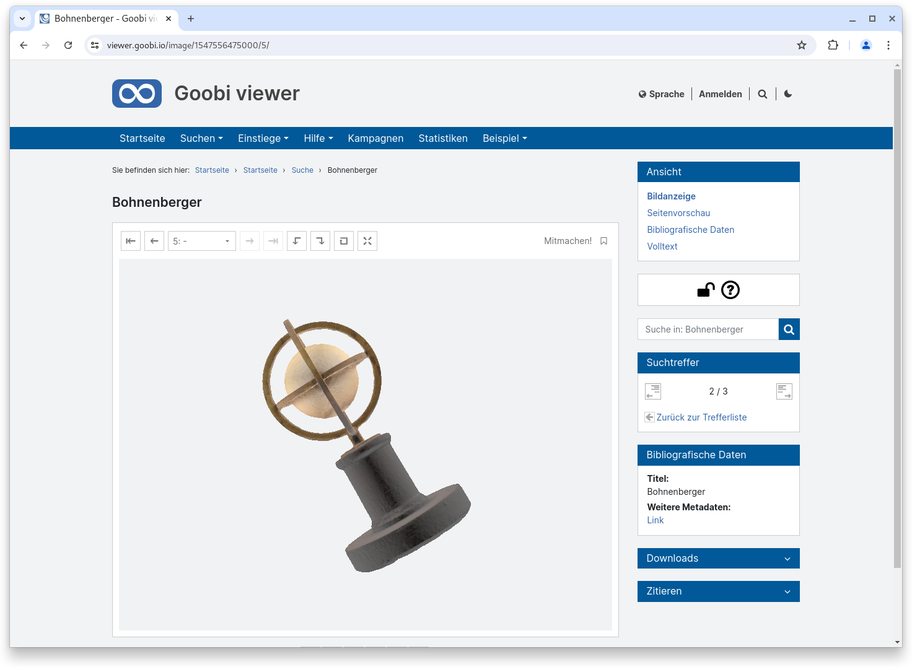
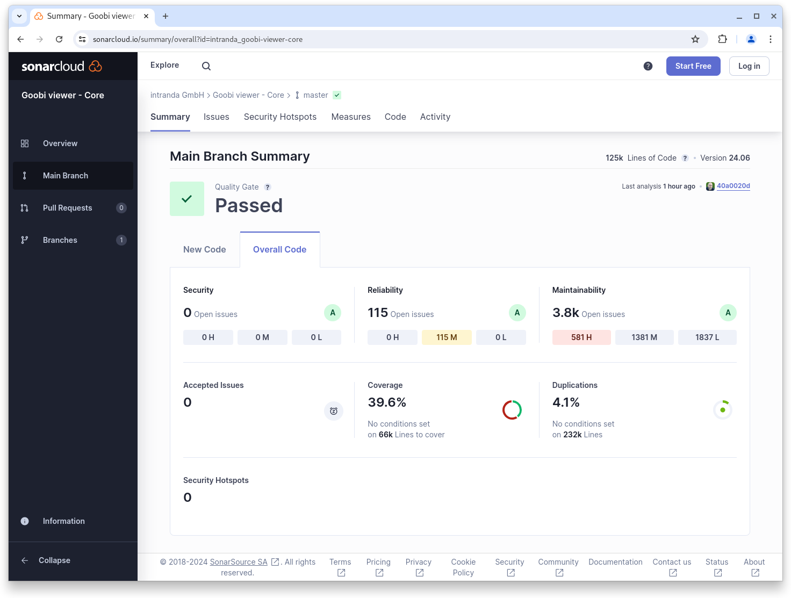

# Juni

## Coming soon :rocket:

* **technische Metadaten** aus Bildern
* **S3** Speicher
* **zugriffsbeschränkte Metadaten**

## Ankündigungen


Im **Juli** und **August** wird das **Goobi viewer Team** wegen verschiedener Jahresurlaube nur **eingeschränkt** zur Verfügung stehen.&#x20;


## Entwicklungen

### Archive

Die Präsentation von Archivbeständen im Goobi viewer wurde im Unterbau komplett neu entwickelt. Dafür haben wir uns von BaseX als Datenbank und Datenquelle gelöst und die EAD-Dateien werden jetzt - wie alle anderen Metadatenformate auch - in den Apache Solr Suchindex geschrieben. Dieser Ansatz hat verschiedene Vorteile. Zum Beispiel ist der Datenfluss jetzt wieder für alle unterstützen Formate gleich: die Dateien werden im Hotfolder abgelegt und der Goobi viewer Indexer kümmert sich um die Aufbereitung. Ein weiterer Vorteil ist, dass durch den einheitlichen Ort der Datenspeicherung eine formatübergreifende Suche im Gesamtbestand des Goobi viewers möglich ist. In der bekannten Suchmaske werden jetzt auch Archivbestände gefunden. Das war vorher nicht der Fall, da nicht innerhalb von Solr und BaseX gleichzeitig gesucht und die Ergebnisse dann zusammengeführt werden konnten. Ein positiver Nebeneffekt ist auch, dass jetzt Knoten gefunden werden können, zu denen kein Digitalisat existiert. Bei den einzelnen Treffern kann jetzt Wahlweise die Werksansicht oder die Archivansicht geöffnet werden:

<figure><figcaption><p>Suchtreffer zeigen Digitalisat von Verzeichnungseinheit und Treffer im Archivbestand</p></figcaption></figure>

Durch die Umstellung wurde auch die Konfiguration der Archivmetadaten angeglichen. Die bisherige, ganz eigene Art- und Weise wurde entfernt und die Konfiguration erfolgt nun über die überall in der `config_viewer.xml` verwendete Syntax.

Durch die Umstellung konnte weiter eine massive Performanceverbesserung erreicht werden. Auch sehr große Archivbäume (60MB EAD-Datei mit knapp 170.000 Knoten) können jetzt schnell geladen, betrachtet und darin navigiert werden.

Ein weiteres Feature ist die Unterstützung von Zugriffsbeschränkungen für einzelne Knoten im Archivbestand. Dadurch lassen sich einzelne Äste verstecken und nur für bestimmte Benutzer / Gruppen oder sonstige Rechtenehmer zugänglich machen.

<figure><figcaption><p>Ausgewählte Verezeichnungseinheit im Archivbaum</p></figcaption></figure>

<figure><figcaption><p>Digitalisat in Werksansicht mit Archiv-Widget zur Verortung im Bestand</p></figcaption></figure>

### Config Editor

Die Möglichkeiten zur Bearbeitung von Konfigurationsdateien im Goobi viewer Backend wurde erweitert. Neu hinzugekommen ist die Möglichkeit Konfigurationsdateien auch direkt hoch und runterladen zu können. Um die dafür notwendigen Icons im bestehenden Design unterzubringen ist der Statusindikator (Datei nur lesend oder Datei gesperrt) jetzt an den Anfang der jeweiligen Zeile gewandert.

Außerdem können Backups von Dateien jetzt nicht mehr nur heruntergeladen, sondern per Klick auch direkt in den integrierten Editor übernommen werden. Dadurch erhöht sich die Bedienbarkeit deutlich!

Im Hintergrund wurde noch eine Änderung am Encoding beim Speichern der `config_viewer.xml` vorgenommen. Diese wurde immer mit **CRLF** (Carriage Return, Line Feed) Zeilenumbrüchen geschrieben, auch wenn der Goobi viewer auf einem Linuxserver installiert war. Das führte dann beim Bearbeiten der Datei auf der Kommandozeile zu unschönen `^M` Zeichen an jedem Zeilenende. Jetzt werden die Zeilenumbrüche gemäß Systemeinstellung gesetzt. CRLF wird weiterhin auf Windows Systemen genutzt, Linuxsysteme nutzen jetzt aber korrekterweise **NL** (New Line).

<figure><figcaption><p>Erweiterte Funktionalität im integrierten Konfigurationseditor</p></figcaption></figure>

### 3D-Objekte

3D Dateien werden nicht mehr sofort beim Öffnen der entsprechenden Seite im Goobi viewer heruntergeladen, sondern es erscheint eine vorgeschaltete Information, die darauf hinweist, wie viele Daten dafür heruntergeladen werden müssen. Klickt man dann auf den Anzeigen Button erscheint ein Fortschrittsbalken, der über den Download informiert.

Die Anzeige der 3D Objekte ist gleich geblieben, aber die Bedienbarkeit wurde gerade bei großen Dateien durch diese Änderung deutlich verbessert.

<figure><figcaption><p>Ein Text informiert über die für die 3D Anzeige herunterzuladende Datenmenge</p></figcaption></figure>

<figure><figcaption><p>Eine Progressbar informiert über den Fortschritt</p></figcaption></figure>

<figure><figcaption><p>Am Ende wird das 3D-Objekt wie gewohnt im Webbrowser präsentiert.</p></figcaption></figure>

### Snippets

* Core: In der erweiterten Suche werden die Filter jetzt standardmäßig automatisch in dem ersten DropDown Feld mit aufgelistet.
* Core: Badges von Zitierlinks wurden trotz korrekter Konfiguration nicht vollständig angezeigt. Der Fehler wurde behoben.
* Core: Wenn Bilder über eine externe IIIF Schnittstelle eingebunden werden, stehen dort nun auch die Standard Downloadoptionen zur Verfügung
* Core: Die Anzeige für das Widget zur Suche im Werk kann jetzt optional an die Verfügbarkeit von Volltexten geknüpft werden.
* Indexer: Die Indexierung von METS/MARC Datensätzen wurde erweitert.

## Codenanalyse

Die folgenden Screenshots zeigen die SonarCloud Analyse des aktuellen Releases. Weitere Informationen gibt es direkt auf der [Projektseite](https://sonarcloud.io/organizations/intranda/projects).

<figure><figcaption><p>SonarCloud Analyse: Goobi viewer Core - für den Git Tag v24.06</p></figcaption></figure>

<figure><figcaption><p>SonarCloud Analyse: Goobi viewer Indexer - für den Git Tag v24.06</p></figcaption></figure>

<figure><figcaption><p>SonarCloud Analyse: Goobi viewer Connector - für den Git Tag v24.06</p></figcaption></figure>

## Versionsnummern

Die Versionen die in der `pom.xml` des Themes eingetragen werden müssen um die in diesem Digest beschriebenen Funktionen zu erhalten lauten:

```xml
<dependency>
    <groupId>io.goobi.viewer</groupId>
    <artifactId>viewer-core</artifactId>
    <version>24.06</version>
</dependency>
<dependency>
    <groupId>io.goobi.viewer</groupId>
    <artifactId>viewer-core-config</artifactId>
    <version>24.06</version>
</dependency>
<dependency>
    <groupId>io.goobi.viewer</groupId>
    <artifactId>viewer-connector</artifactId>
    <version>24.06</version>
</dependency>
```

Der Goobi viewer Indexer hat die Versionsnummer **24.06**\
Das Goobi viewer Crowdsourcing Modul hat die Versionsnummer **24.06**
