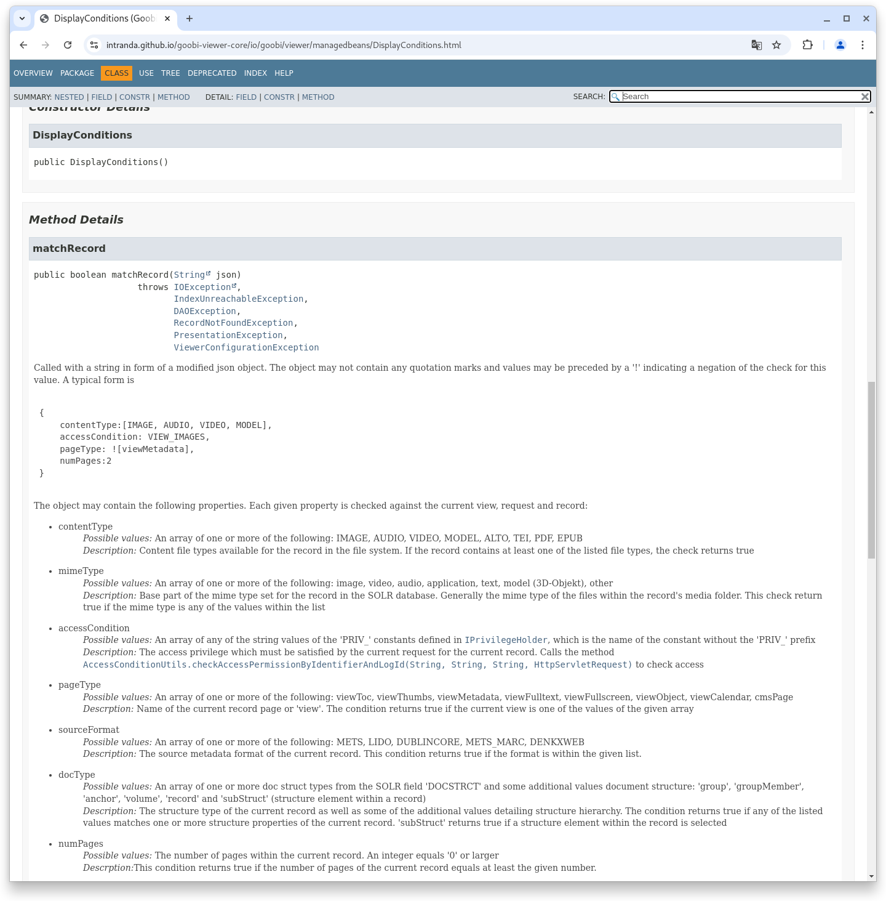
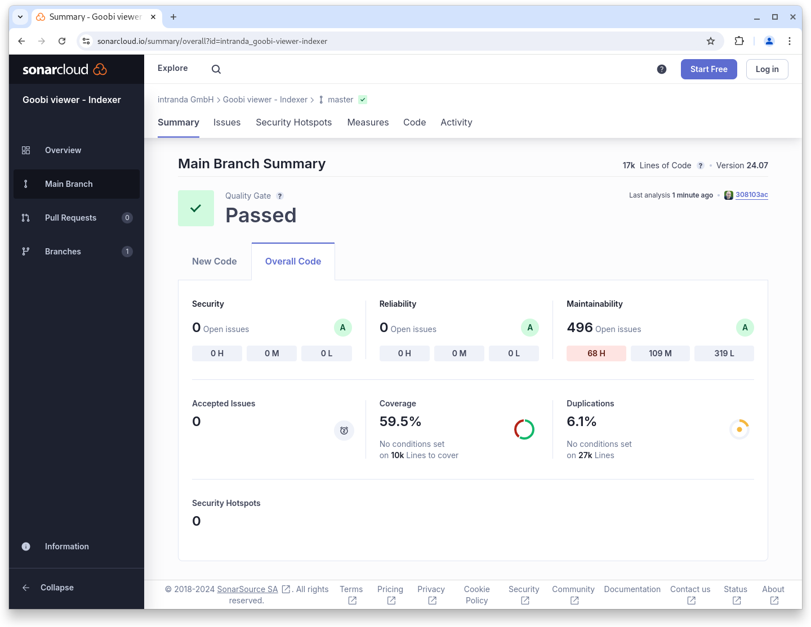
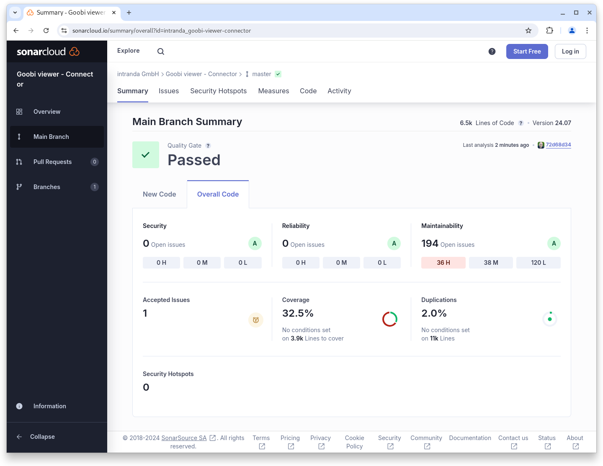

# Juli

## Coming soon :rocket:

* **Jahresauswahl** in Kalendersuche als **Übersicht**
* **technische Metadaten** aus Bildern
* **zugriffsbeschränkte Metadaten**

## Ankündigungen


Im **Juli** und **August** wird das **Goobi viewer Team** wegen verschiedener Jahresurlaube nur **eingeschränkt** zur Verfügung stehen.&#x20;


## Entwicklungen

### Sidebarwidgets

Die Bedingungen unter der Widgets oder Inhalte von Widgets in der Sidebar angezeigt werden ist über die Jahre immer weiter gewachsen und angepasst worden. Mit dem Juli-Release haben wir hier einmal grundlegend aufgeräumt und ein einheitliches, neues System eingeführt mit der gesteuert werden kann was wann und wie angezeigt wird. Vermutlich wird es hier in den kommenden Monaten noch nacharbeiten geben weil uns bei der Migration das ein- oder andere durchgerutscht ist, aber die neuen DisplayConditions helfen uns hier in der Zukunft den Überblick zu behalten. Weitere Infos dazu, gerade für Entwickler,  gibt es in den Javadocs:

<figure><figcaption><p>Beispiel Javadoc für die matchRecord Methode in der DisplayConditions Klasse</p></figcaption></figure>


Link zum Javadoc


### Snippets

* Im Goobi viewer Desktop Client können jetz EPub Dokumente inline angezeigt werden
* Ein nerviger Bug, der beim Download unter Windows JPEG Dateien als JFIF heruntergeladen hat wurde durch die Implementierung eines Workarounds behoben

## Codenanalyse

Die folgenden Screenshots zeigen die SonarCloud Analyse des aktuellen Releases. Weitere Informationen gibt es direkt auf der [Projektseite](https://sonarcloud.io/organizations/intranda/projects).

<figure><figcaption><p>SonarCloud Analyse: Goobi viewer Core - für den Git Tag v24.07</p></figcaption></figure>

<figure><figcaption><p>SonarCloud Analyse: Goobi viewer Indexer - für den Git Tag v24.06</p></figcaption></figure>

<figure><figcaption><p>SonarCloud Analyse: Goobi viewer Connector - für den Git Tag v24.06</p></figcaption></figure>

## Versionsnummern

Die Versionen die in der `pom.xml` des Themes eingetragen werden müssen um die in diesem Digest beschriebenen Funktionen zu erhalten lauten:

```xml
<dependency>
    <groupId>io.goobi.viewer</groupId>
    <artifactId>viewer-core</artifactId>
    <version>24.07.8</version>
</dependency>
<dependency>
    <groupId>io.goobi.viewer</groupId>
    <artifactId>viewer-core-config</artifactId>
    <version>24.07.2</version>
</dependency>
<dependency>
    <groupId>io.goobi.viewer</groupId>
    <artifactId>viewer-connector</artifactId>
    <version>24.07</version>
</dependency>
```

Der Goobi viewer Indexer hat die Versionsnummer **24.07.1**\
Das Goobi viewer Crowdsourcing Modul hat die Versionsnummer **24.07.1**
