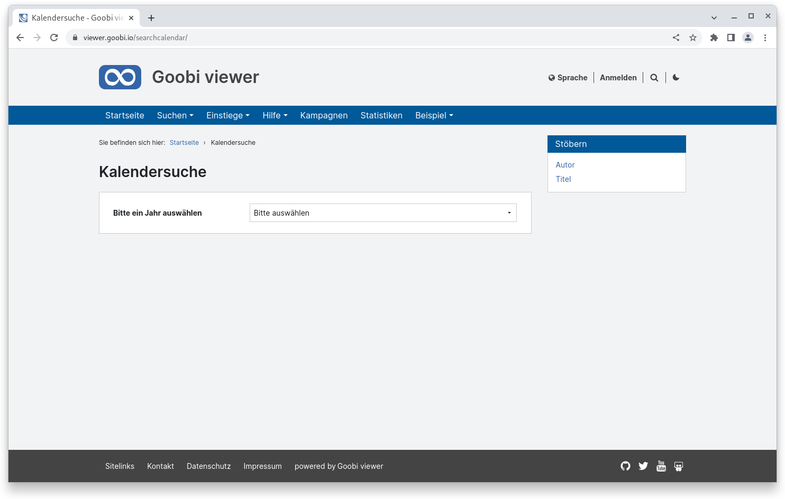
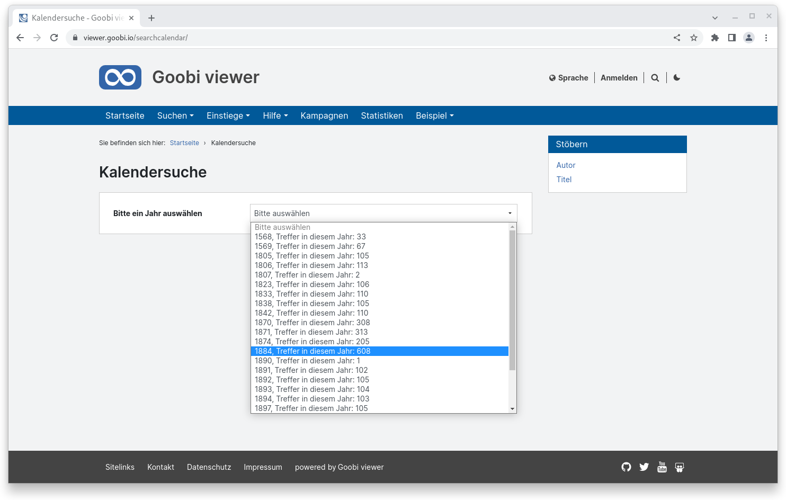
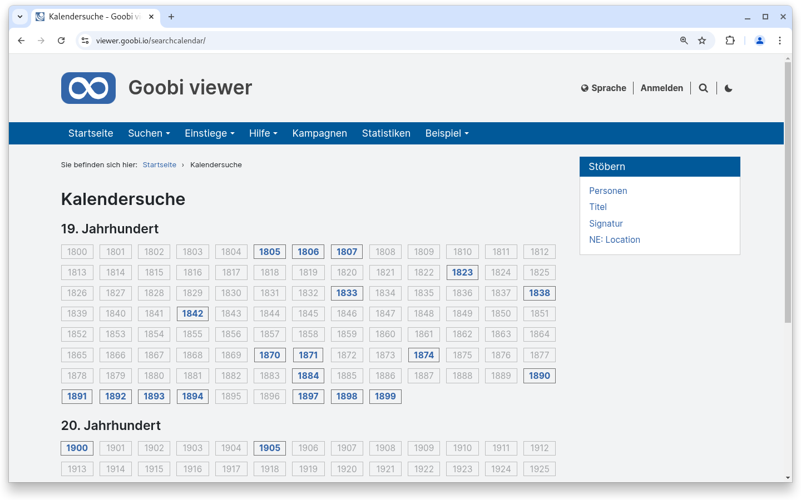
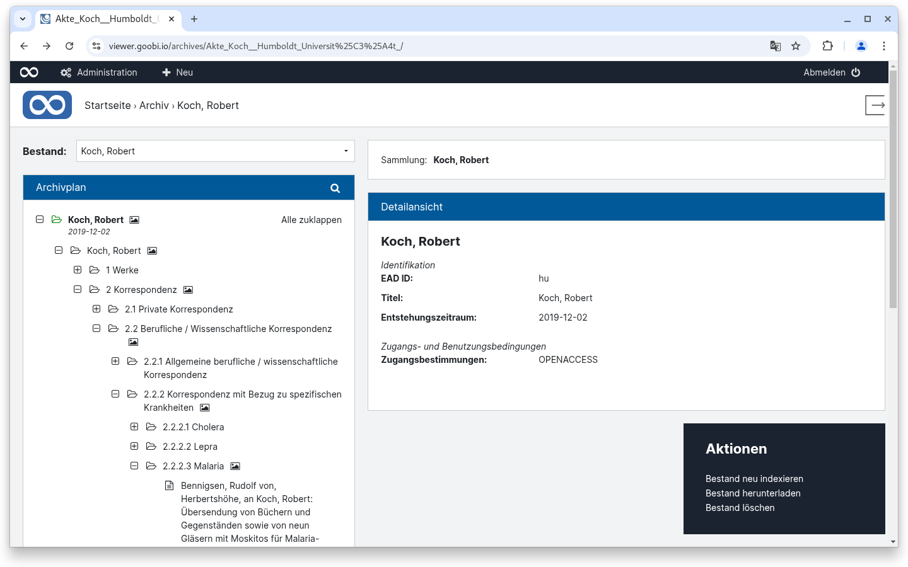
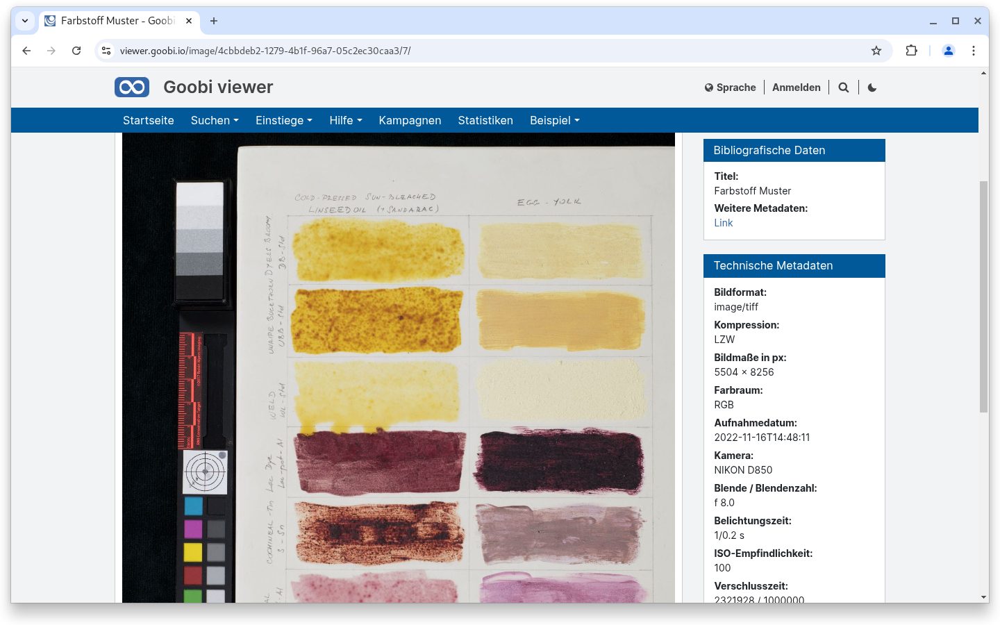
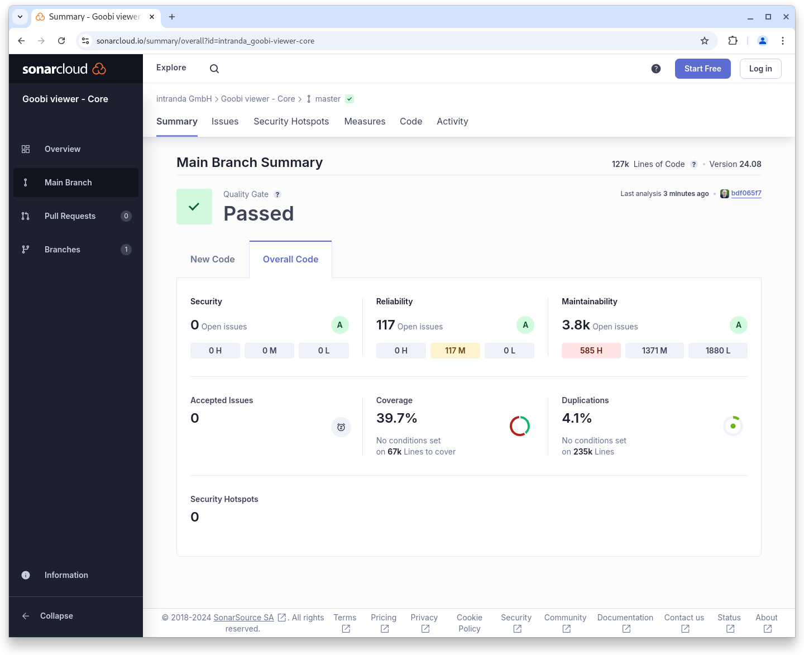
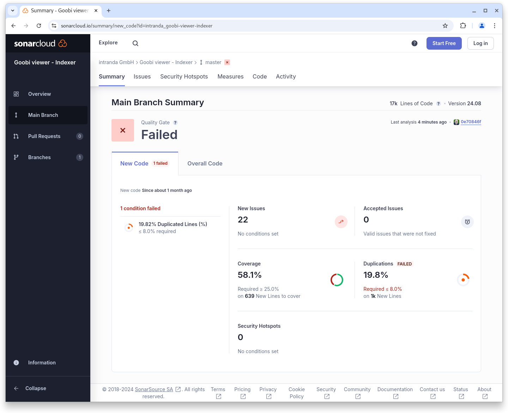

# August

## Coming soon :rocket:

* **mehrere Masken** innerhalb  der **erweiterte Suche**
* **zugriffsbeschränkte Metadaten**

## Ankündigungen


Im **Juli** und **August** wird das **Goobi viewer Team** wegen verschiedener Jahresurlaube nur **eingeschränkt** zur Verfügung stehen.&#x20;


## Entwicklungen

### Kalender

Bisher wurde die Jahresauswahl in der Kalendersuche als Dropdown Menü angezeigt:

<figure><figcaption><p>Kalendersuche mit Dropdown Menü</p></figcaption></figure>

<figure><figcaption><p>Kalendersuche mit aufgeklapptem Dropdown Menü</p></figcaption></figure>

Diese Ansicht wurde jetzt über eine Auflistung nach Jahrhundert und einzelnen Badges für die Jahre abgelöst. Über eine klare visuelle Abgrenzung ist der Einstieg in das gewünschte Jahr jetzt schneller und mit weniger Klicks zu erreichen.

<figure><figcaption><p>Kalendersuche mit neuem Einstieg nach Jahrhunderten</p></figcaption></figure>

### Archive

Im Rahmen der Archiventwicklungen gab es verschiedene kleinere Nacharbeiten und Feature-Entwicklungen um die Lösung abzuschließen.

Eine kleinere aber für die Konfiguration sehr essentielle Änderung ist, dass Änderungen in der Konfigurationsdatei direkt in der Anzeige übernommen werden und keine neue Session oder ein Neustart der Applikation notwendig sind.

Für Administratoren wurde die Topbar in die Archivansicht integriert und auch das bereits aus der Werksansicht bekannte Widget "Aktionen" eingeführt. In dem Widget kann ein Bestand neu indexiert, heruntergeladen oder gelöscht werden.

<figure><figcaption><p>Archivansicht mit Topbar und Admin-Widget</p></figcaption></figure>

Wenn für eine Verzeichnungseinheit Digitalisate vorliegen, wird dieses über ein Piktogramm im Baum angezeigt. Wenn diese Digitalisate jetzt einer Zugriffsbeschränkung unterliegen wird das ebenfalls visualisiert.

### technische Metadaten aus Bildern

Der Goobi viewer Indexer wurde erweitert um technische Metadaten aus Bilder, die als MIX in der METS/MODS Datei vorliegen, zu indexieren. Dabei erfolgt die Konfiguration analog zu den deskriptiven Metadaten:

<pre class="language-xml"><code class="lang-xml">&#x3C;MD_TECH_FORMAT_NAME>
<strong>    &#x3C;list>
</strong>        &#x3C;item>
            &#x3C;xpath>mets:xmlData/mix:mix/mix:BasicDigitalObjectInformation/mix:FormatDesignation/mix:formatName&#x3C;/xpath>
            &#x3C;addToDefault>false&#x3C;/addToDefault>
        &#x3C;/item>
    &#x3C;/list>
&#x3C;/MD_TECH_FORMAT_NAME>
</code></pre>

Der Goobi viewer Core kann die Metadaten dann in einem eigenen Widget in der Sidebar anzeigen. Dafür werden die gewünschten Daten in der `<metadataList type="page" />` konfiguriert:

```xml
<metadataList type="page">
    <template name="_DEFAULT">
        <metadata label="MD_TECH_FORMAT_NAME">
            <param key="MD_TECH_FORMAT_NAME" type="field" />
        </metadata>
        <metadata label="MD_TECH_BASIC_IMAGE_INFO" value="{1}{3}" group="true">
            <param key="MD_VALUE" type="field" />
            <param key="MD_TECH_IMAGE_COLOR_SPACE" type="field" prefix=",_SPACE_" />
        </metadata>
        <metadata label="MD_TECH_BYTE_ORDER">
            <param key="MD_TECH_BYTE_ORDER" type="field" />
        </metadata>
        <metadata label="MD_TECH_IMAGE_DATETIME_CREATED">
            <param key="MD_TECH_IMAGE_DATETIME_CREATED" type="datefield" pattern="yyyy-MM-dd'T'HH:mm:ss" />
        </metadata>
    </template>
</metadataList>
```

<figure><figcaption><p>Anzeige von technischen Metadaten zum Bild in der Sidebar</p></figcaption></figure>

### Snippets

* **IIIF**: Der Change Discovery API kann jetzt optional als GET Parameter auch ein statDate und ein Filter als Solr-Query übergeben bekommen
* **Sidebar**: Der RIS Download Badge ist jetzt konfigurierbar
* **CMS**: Die Anzeige der Optionen oberhalb der Suchtrefferliste ist jetzt ein- und ausstellbar
* **CMS**: Intern wurde der Quelltext für die verschiedenen Sammlungsanzeigen (Kacheln, Baum, Liste) überarbeitet und vereinheitlicht
* **Suchtreffer**: Die Suchtreffer werden jetzt homogener dargestellt, wenn es eine Mischung aus Treffern mit und ohne Bildern gibt. \
  Auch ist die Konfiguration von gruppierten Metadaten jetzt für die Suchtrefferliste möglich.

## Codenanalyse

Die folgenden Screenshots zeigen die SonarCloud Analyse des aktuellen Releases. Weitere Informationen gibt es direkt auf der [Projektseite](https://sonarcloud.io/organizations/intranda/projects).

<figure><figcaption><p>SonarCloud Analyse: Goobi viewer Core - für den Git Tag v24.08</p></figcaption></figure>

<figure><figcaption><p>SonarCloud Analyse: Goobi viewer Indexer - für den Git Tag v24.08</p></figcaption></figure>

<figure><figcaption><p>SonarCloud Analyse: Goobi viewer Connector - für den Git Tag v24.08</p></figcaption></figure>

**Hinweis**: Im Goobi viewer Indexer ist bedingt durch die Entwicklung von neuer Funktionalität das Quality Gate nicht erreicht worden, da es zu viele Codedopplungen gibt. Das gilt aber nur für neuen Quelltext. Das Quality Gate für den gesamten Code wurde erreicht.

## Versionsnummern

Die Versionen die in der `pom.xml` des Themes eingetragen werden müssen um die in diesem Digest beschriebenen Funktionen zu erhalten lauten:

```xml
<dependency>
    <groupId>io.goobi.viewer</groupId>
    <artifactId>viewer-core</artifactId>
    <version>24.08.4</version>
</dependency>
<dependency>
    <groupId>io.goobi.viewer</groupId>
    <artifactId>viewer-core-config</artifactId>
    <version>24.08</version>
</dependency>
<dependency>
    <groupId>io.goobi.viewer</groupId>
    <artifactId>viewer-connector</artifactId>
    <version>24.08</version>
</dependency>
```

Der Goobi viewer Indexer hat die Versionsnummer **24.08**\
Das Goobi viewer Crowdsourcing Modul hat die Versionsnummer **24.08**
