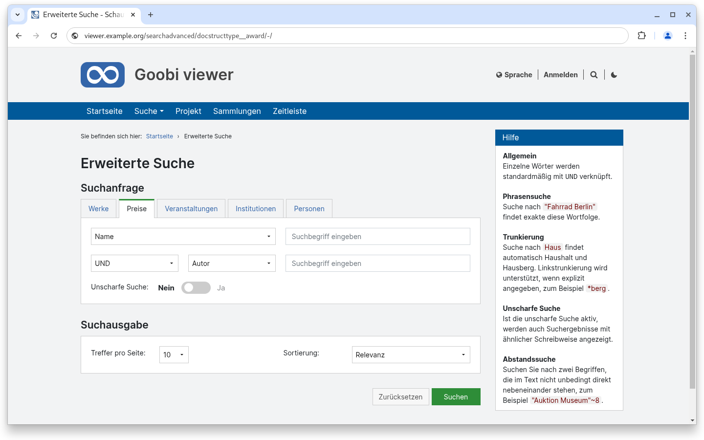
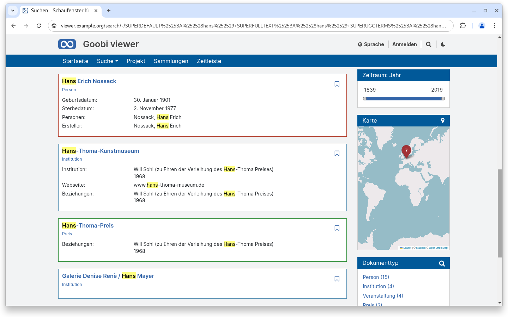
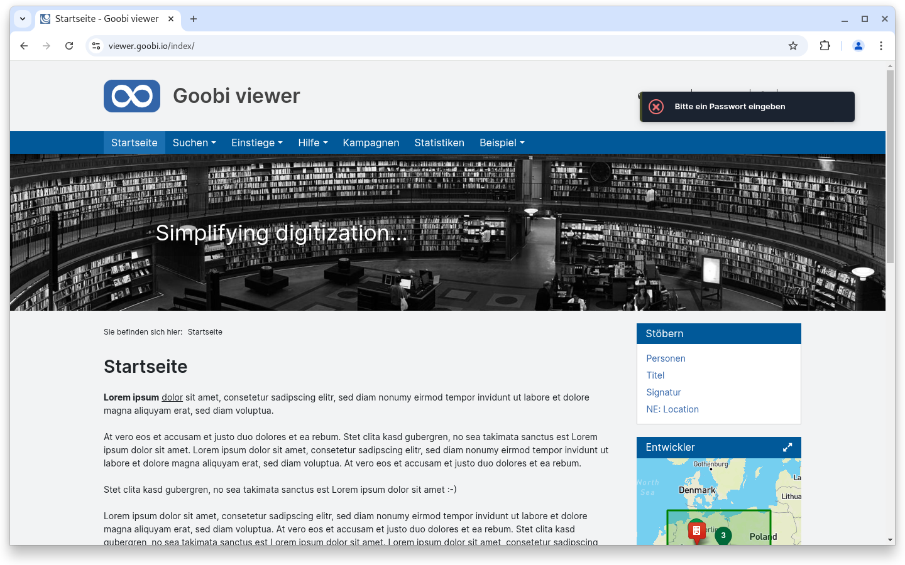
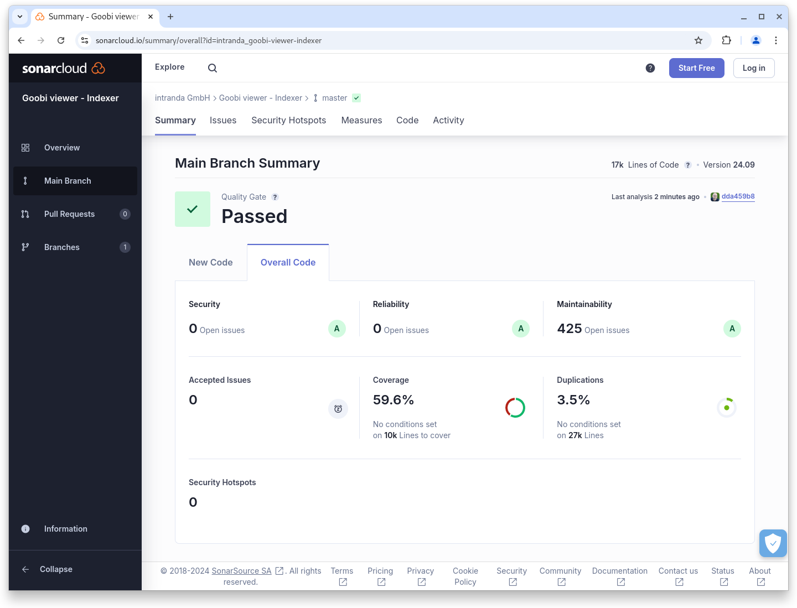

# September

## Coming soon :rocket:

* **zugriffsbeschränkte Metadaten**
* **Metadaten: Konfiguration** und **Anzeige**

## Ankündigungen


Mit dieser Version wird die Solr interne Verwaltung der Iddocs auf einen alternativen Datentyp umgestellt. Dieses ist eine Vorbereitung auf eine **Breaking-Change** Änderung im Goobi viewer Indexer die für **Januar 2025** vorgesehen ist.


## Entwicklungen

### Erweiterte Suche

Schon länger gab es im Goobi viewer Core die Möglichkeit für die erweiterte Suche verschiedene Suchmaskentemplates zu konfigurieren. Allerdings war die Umsetzung der Funktionalität bisher nur mit spezieller Entwicklung innerhalb einzelner Themes möglich. Mit diesem Release wurde auch die optische Umsetzung in den Goobi viewer Core integriert, so dass die Funktionalität generell genutzt werden kann. Die verschiedenen Suchtemplates werden als einzelne Tabs angezeigt.

Über das Styling im Theme ist es zusätzlich möglich, dass den einzelnen Tabs eigene Farben zuzuweisen. Diese Farbe spiegelt sich dann als farbiger Balken oberhalb des Tabs und im Suchbutton wieder.

<figure><figcaption><p>Verschiedene Templates in der erweiterten Suche plus individuelle Farben</p></figcaption></figure>

Zusammen mit der Möglichkeit auch für Suchtreffer und Werksseiten CSS-Klassen zu definieren besteht darüber die Möglichkeit von der Suchmaske über die Suchtreffer bis hin zur Werksanzeige einheitliche Farben zu realisieren.

<figure><figcaption><p>individuelle Farben für verschiedene Suchtreffer</p></figcaption></figure>

### Benachrichtigungen

Die Benachrichtigungen des Goobi viewers werden jetzt ebenfalls in dem aus dem Backend bekannten, dunklen Farbstil angezeigt. Die Sicbhtbarkeit gerade in hellen Themes und auf hellen Hintergründen wird damit signifikant erhöht. Auzh wird damit das Farbschema konsequent fortgeführt. Alle Aktionen die mit dem Backend, der Verwaltung oder von der Applikation selbst kommen sind jetzt in einem dunklen Farbton gehalten und dadurch direkt als solche zu erkennen und zuzuordnen.

<figure><figcaption><p>Die Benachrichtigungen des Goobi viewers sind jetzt dunkel</p></figcaption></figure>

### Snippets

* Backend: Die für Administratoren am oberen Bildschirmrand permanent sichtbare Topbar zeigt nun auch Informationen über die Hintergrundaufgaben an.
* Archiv: Ab sofort ist es möglich den Baum per Klick auf- und auch wieder zuzuklappen.
* Performance: Innerhalb der Archivansicht und auch innerhalb der Facetten wurde die Geschwindigkeit für manche Operationen deutlich verbessert.
* Download: Der PDF Download wird nur noch für lokal vorliegende Bilder, nicht mehr für von Extern eingebundene Bilder angeboten.

## Codenanalyse

Die folgenden Screenshots zeigen die SonarCloud Analyse des aktuellen Releases. Weitere Informationen gibt es direkt auf der [Projektseite](https://sonarcloud.io/organizations/intranda/projects).

<figure><figcaption><p>SonarCloud Analyse: Goobi viewer Core - für den Git Tag v24.09</p></figcaption></figure>

<figure><figcaption><p>SonarCloud Analyse: Goobi viewer Indexer - für den Git Tag v24.09</p></figcaption></figure>

<figure><figcaption><p>SonarCloud Analyse: Goobi viewer Connector - für den Git Tag v24.09.1</p></figcaption></figure>

## Versionsnummern

Die Versionen die in der `pom.xml` des Themes eingetragen werden müssen um die in diesem Digest beschriebenen Funktionen zu erhalten lauten:

```xml
<dependency>
    <groupId>io.goobi.viewer</groupId>
    <artifactId>viewer-core</artifactId>
    <version>24.09.8</version>
</dependency>
<dependency>
    <groupId>io.goobi.viewer</groupId>
    <artifactId>viewer-core-config</artifactId>
    <version>24.09.2</version>
</dependency>
<dependency>
    <groupId>io.goobi.viewer</groupId>
    <artifactId>viewer-connector</artifactId>
    <version>24.09.1</version>
</dependency>
```

Der Goobi viewer Indexer hat die Versionsnummer **24.09**\
Das Goobi viewer Crowdsourcing Modul hat die Versionsnummer **24.09**
