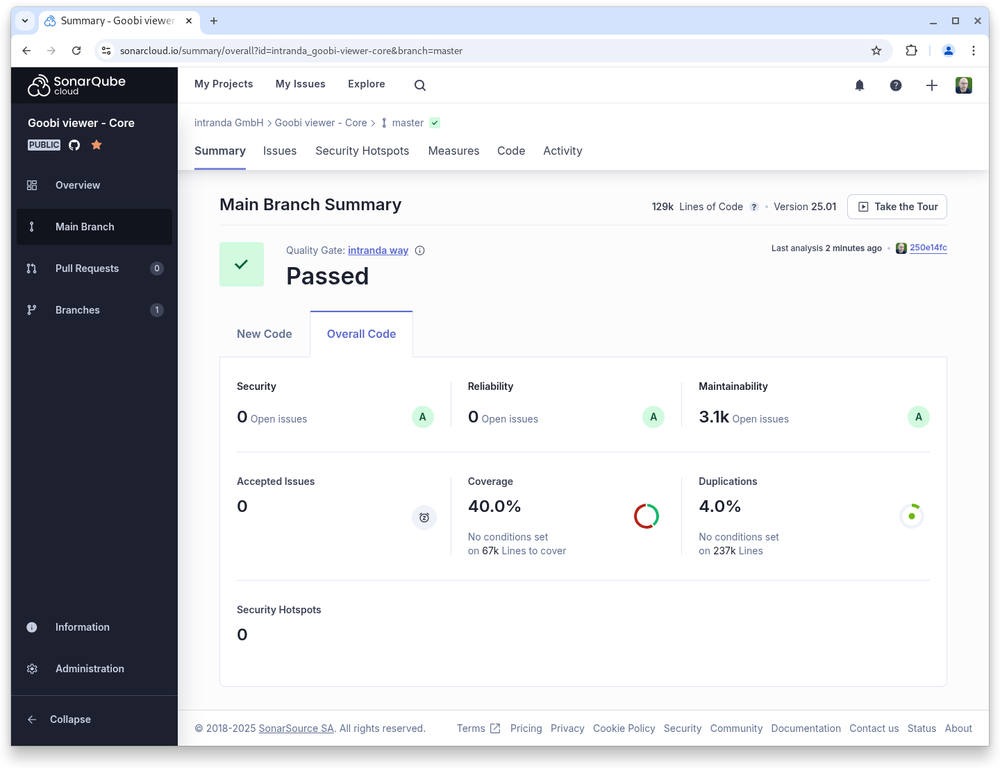
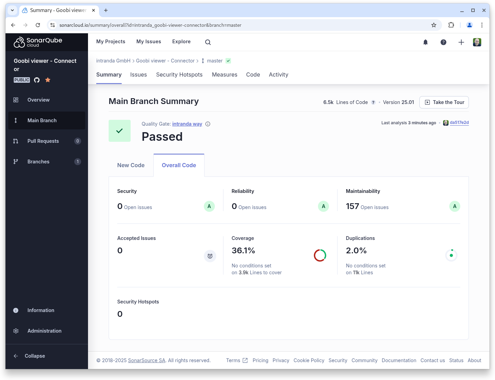

# Januar

## Coming soon :rocket:

* zentrale **Ankündigungen** von **Wartungsarbeiten**
* Unterstützung für das **METS/MODS** vom **DDB Zeitungsportal**

## Entwicklungen

### Technisches

Das Januar Release des Goobi viewers enthält keine neuen Features, dafür aber eine große Menge an Updates und Änderungen unter der Haube.&#x20;


Trotz aller technischen Änderungen ändert sich an den Daten nichts.


Bei den Änderungen sind vor allem die folgenden Themen hervorzuheben:

#### Java 21

Der Goobi viewer und seine dazugehörigen Komponenten setzen jetzt Java 21 voraus. Das bedeutet, dass sowohl das Java Runtime Environment (der Part, der auf dem Server installiert sein muss) wie auch das Java Development Kit (der Part, mit dem die Entwickler arbeiten und mit dem die Anwendungen kompiliert werden) Java 21 sein müssen. Der Wechsel wurde notwendig, um kompatibel zu verwendeten Java-Bibliotheken zu bleiben und dadurch auch in Zukunft Sicherheitsupdates zu ermöglichen.

#### Tomcat 10

Schon vor einigen Jahren ging ein Ruck durch die Java-Szene und aus `Javax` wurde `Jakarta`. Diese Änderung im Unterbau war so weitreichend, dass es einige Jahre dauerte bis sie auch in der Breite der Java Welt / Java Bibliotheken angekommen ist. Diese Änderung ist aber nicht abwärtskompatibel und je mehr externe Libraries verwendet werden, desto mehr Libraries mussten auch von sich aus erst einmal diese Umstellung machen.&#x20;

Am Ende haben die Linux-Distributionen für uns entschieden, dass wir jetzt diese Umstellung auch im Goobi viewer machen. Die aktuell stabile Debian Version, wie auch die aktuell stabile Ubuntu Linux Server LTS Version liefert keine Pakete mehr für Tomcat 9 aus. Das bedeutet, dass wir diese Pakete von Hand hätten installieren und Pflegen müssen. Ausgeliefert werden Pakete für Tomcat 10.1 mit der Unterstützung für Jakarta EE 10. Damit ist die Umstellung von `Javax` zu `Jakarta` Pflicht.&#x20;

#### Solr 9.8.0

Wir haben uns gedacht, dass wenn im Januar schon viele technische Komponenten nicht abwärtskompatibel sind, wir auch gleich den Solr Server aktualisieren. Hier war ein Schema Update notwendig inklusive einer Neuindexierung des Datenbestandes, da veraltete Feldtypen umgestellt wurden. Weiter wurde die Konfiguration von deprecated Elementen auf die aktuelle Syntax angepasst.

#### Goobi viewer Indexer

Wenn in der Konfiguration für ein Feld mehrere XPATH-Ausdrücke angegeben werden mussten war das bisher mit einer verschachtelten Liste unnötig komplex. Diese Verschachtelung haben wir mit dem Januar Release entfernt. Die Konfiguration wird dadurch übersichtlicher, einfacher zu lesen und anzupassen. Eine XSL Datei und entsprechende Aufrufe für die automatische Migration der Konfiguration stehen in der Updateanleitung zur Verfügung.

### Snippets

* **Core:** Das XSLT, das bei der Auslieferungen von METS-Dateien angewendet wird, wurde um das Herausfiltern der METS fileGrp PRESENTATION erweitert.
* **Indexer**: Ein Bug, der dazu führte das EAD Bestände mit Zeitstempel mehrfach indexiert wurden, wurde behoben.
* **Kalender**: In der Kalendersuche wird jetzt nach der Auswahl eines Jahres dieses auch über dem Kalender angezeigt.

## Codenanalyse

Die folgenden Screenshots zeigen die SonarCloud Analyse des aktuellen Releases. Weitere Informationen gibt es direkt auf der [Projektseite](https://sonarcloud.io/organizations/intranda/projects).

<figure><figcaption><p>SonarCloud Analyse: Goobi viewer Core - für den Git Tag v25.01</p></figcaption></figure>

<figure><figcaption><p>SonarCloud Analyse: Goobi viewer Indexer - für den Git Tag v25.01</p></figcaption></figure>

<figure><figcaption><p>SonarCloud Analyse: Goobi viewer Connector - für den Git Tag v25.01</p></figcaption></figure>

## Versionsnummern

Die Versionen die in der `pom.xml` des Themes eingetragen werden müssen um die in diesem Digest beschriebenen Funktionen zu erhalten lauten:

```xml
<dependency>
    <groupId>io.goobi.viewer</groupId>
    <artifactId>viewer-core</artifactId>
    <version>25.01</version>
</dependency>
<dependency>
    <groupId>io.goobi.viewer</groupId>
    <artifactId>viewer-core-config</artifactId>
    <version>25.01</version>
</dependency>
<dependency>
    <groupId>io.goobi.viewer</groupId>
    <artifactId>viewer-connector</artifactId>
    <version>25.01</version>
</dependency>
```

Der Goobi viewer Indexer hat die Versionsnummer **25.01**\
Das Goobi viewer Crowdsourcing Modul hat die Versionsnummer **25.01**
