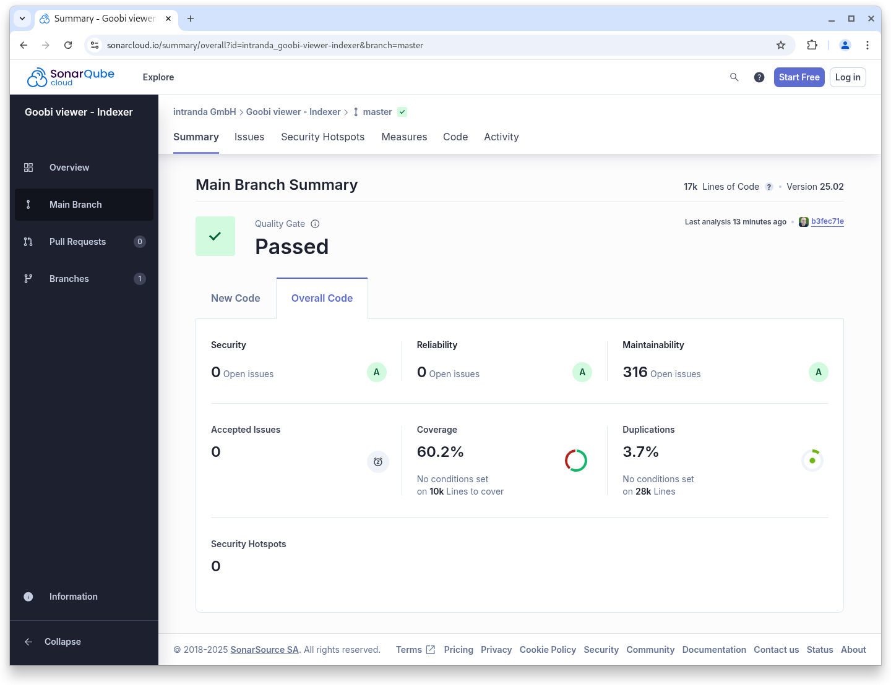
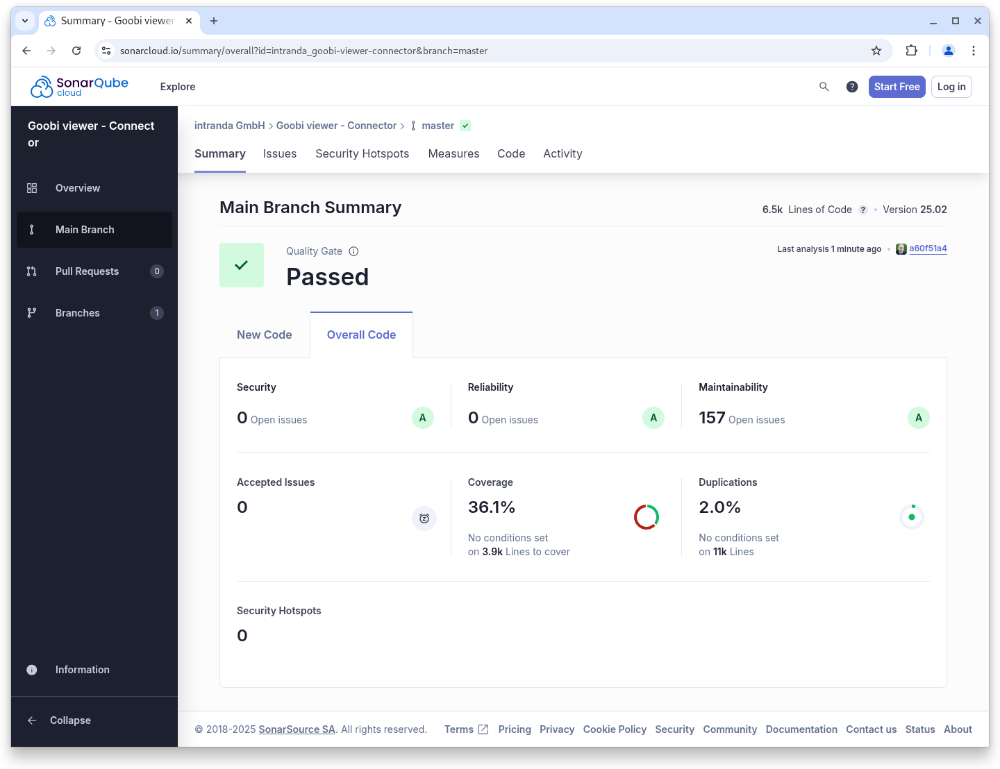

# Februar

## Coming soon :rocket:

* zentrale **Ankündigungen** von **Wartungsarbeiten**
* Unterstützung für das **METS/MODS** vom **DDB Zeitungsportal**

## Entwicklungen

### Allgemein

Viel sichtbares gibt es aus dem Februar nicht zu berichten. Wir haben uns vor allem auf den Abschluss von vorhandenen Projekten fokussiert und kleineren Entwicklungen und Anpassungen die von Anwendern an uns herangetragen wurden. Außerdem gab es noch kleinere Nacharbeiten bei der Java 21 und Tomcat 10 Umstellung.

Hervorzuheben ist intern die Überarbeitung der Born-Digital Unterstützung. Hierzu wird es in der Dokumentation noch einen genaueren Anwendungsfall geben der das beschreibt. Wir werden im entsprechenden Digest darauf verweisen.

### Snippets

* **Docker**: Fertigstellung der Java 21, Tomcat 10 und Solr 9.8.0 Umstellung
* **Dokumentation**: Einpflegen von bisher undokumentierten Schaltern und Parametern
* **Archiv**: Für die Zugriffsbeschränkungen innerhalb von Archiven wird nun eine eigene Funktionalität definiert und nicht mehr die für die Anzeige von Metadaten mit verwendet.
* **Metadaten**: Replace-Regeln werden jetzt auch für gruppierte Metadaten angewendet.
* **Bugfix**: Gruppierte Metadaten wurden nach der Einführung der Zugriffsbeschränkungen für Metadaten im Dezember letzten Jahres nicht mehr angezeigt, wenn sie einer abgelaufenen Moving-Wall Konfiguration unterlagen.
* **CMS**: Nicht öffentliche CMS-Seiten blenden jetzt auch die Sidebar vollständig aus.
* **Performance**: Bei der Aufbereitung eines Inhaltsverzeichnisses wurde die Solr-Query verbessert, so dass weniger angefragt und die Performance dadurch verbessert werden konnte.
* **Suche**: Bei der Phrasensuche wurde unter bestimmten Konstellationen keine Untertreffer angezeigt

## Codenanalyse

Die folgenden Screenshots zeigen die SonarCloud Analyse des aktuellen Releases. Weitere Informationen gibt es direkt auf der [Projektseite](https://sonarcloud.io/organizations/intranda/projects).

<figure><figcaption><p>SonarCloud Analyse: Goobi viewer Core - für den Git Tag v25.02</p></figcaption></figure>

<figure><figcaption><p>SonarCloud Analyse: Goobi viewer Indexer - für den Git Tag v25.02</p></figcaption></figure>

<figure><figcaption><p>SonarCloud Analyse: Goobi viewer Connector - für den Git Tag v25.02</p></figcaption></figure>

## Versionsnummern

Die Versionen die in der `pom.xml` des Themes eingetragen werden müssen um die in diesem Digest beschriebenen Funktionen zu erhalten lauten:

```xml
<dependency>
    <groupId>io.goobi.viewer</groupId>
    <artifactId>viewer-core</artifactId>
    <version>25.02</version>
</dependency>
<dependency>
    <groupId>io.goobi.viewer</groupId>
    <artifactId>viewer-core-config</artifactId>
    <version>25.02</version>
</dependency>
<dependency>
    <groupId>io.goobi.viewer</groupId>
    <artifactId>viewer-connector</artifactId>
    <version>25.02</version>
</dependency>
```

Der Goobi viewer Indexer hat die Versionsnummer **25.02**\
Das Goobi viewer Crowdsourcing Modul hat die Versionsnummer **25.02**
